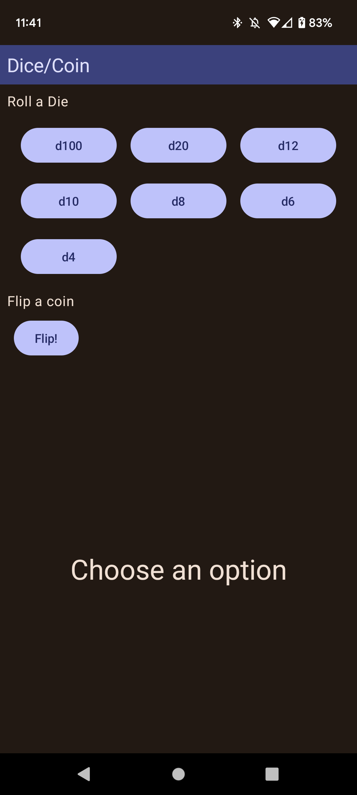

# Board Game Helper app

Simple app to help when playing boardgames

## About

Some of the issues my wife and I have while playing board games are forgetting how many actions we have left when playing Dreamwell, or needing a life counter, or needing to calculate score without paper, etc...

The app theme uses Material You when using Android 12(API 31) or above.

## Design Decisions

For MVP I want to create this mainly with two player in mind since it would just be used between my wife and I. Later down the road I would add support for players > 2 in the future.

Also I am still looking into sharing ViewModels in compose navigation(rather not scope to myNavHost) and NavType String array argument since the documentation for both are not straight forward.

## Screenshots

### Main

### Dreamwell

### Life Counter

### Score Card

### Dice/Coin

## Practice Technologies

- **Material 3** - The app theme is based off of user wallpaper using Material you
- **Compose Navigation**
- **Compose**
- **Flow**

## Future Considerations

- Add more game utilities
- 3 or more player integration
- Quite a few improvements to each implemented ability
- Add graphics and icons to add polish to the app

## Other Notes

As of last time working on this, there was an issue where current Material 3 is missing Dropdown composable support.

I do not like scoping the ViewModels in Compose Navigation(rather not scope to myNavHost), but don't see an Android recommended approach. I am still partial to Fragment navigation, but understand simple apps using Compose Navigation. I have not looked recently, but am sure there is probably a recommended pattern.

Compose Navigation argument usage is not s clear as it could be and documentation is a bit lacking and not straight forward.